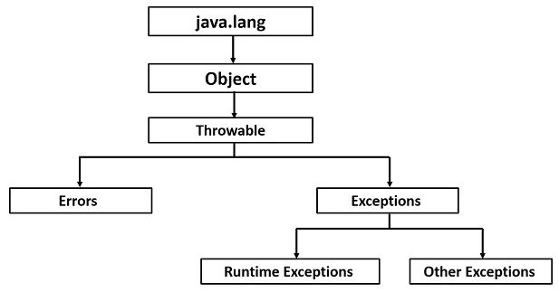

# Exceptions Overview

Many things can go wrong in a program. Java uses exceptions to deal with some of these scenarios. This part focuses on a brief overview of what an exception is, why do we use exceptions, exception hierarchy and catching exception at a very high level.

## What is an Exception?

**Definition:** An exception is an event, which occurs during the execution of a program, that disrupts the normal flow of the program's instructions.

## Why do we use exceptions?

We usually write code in an idealized environment: the filesystem always contains our files, the network is healthy, and the JVM always has enough memory. Sometimes we call this the “happy path”.

In production, though, filesystems can corrupt, networks break down, and JVMs run out of memory. The wellbeing of our code depends on how it deals with “unhappy paths”.

## Exception Hierarchy



**Throwable**: The Throwable class is the superclass of all errors and exceptions in the Java language. Only objects that are instances of this class (or one of its subclasses) are thrown by the Java Virtual Machine or can be thrown by the Java throw statement.

**Error**: An Error is a subclass of Throwable that indicates serious problems that a reasonable application should not try to catch. Most such errors are abnormal conditions.

**Exception**: The class Exception and its subclasses are a form of Throwable that indicates conditions that a reasonable application might want to catch. The class Exception and any subclasses that are not also subclasses of RuntimeException are checked exceptions. Checked exceptions need to be declared in a method or constructor's throws clause if they can be thrown by the execution of the method or constructor and propagate outside the method or constructor boundary.

**Runtime Exception**: RuntimeException is the superclass of those exceptions that can be thrown during the normal operation of the Java Virtual Machine. RuntimeException and its subclasses are unchecked exceptions. Unchecked exceptions do not need to be declared in a method or constructor's throws clause if they can be thrown by the execution of the method or constructor and propagate outside the method or constructor boundary.

## Catching Exceptions

A method catches an exception using a combination of the try and catch keywords. A try/catch block is placed around the code that might generate an exception. Code within a try/catch block is referred to as protected code, and the syntax for using try/catch looks like the following:

```
try {
   // Protected code
} catch (ExceptionName e1) {
   // Catch block
}
```

The code which is prone to exceptions is placed in the try block. When an exception occurs, that exception occurred is handled by catch block associated with it. Every try block should be immediately followed either by a catch block or finally block.
