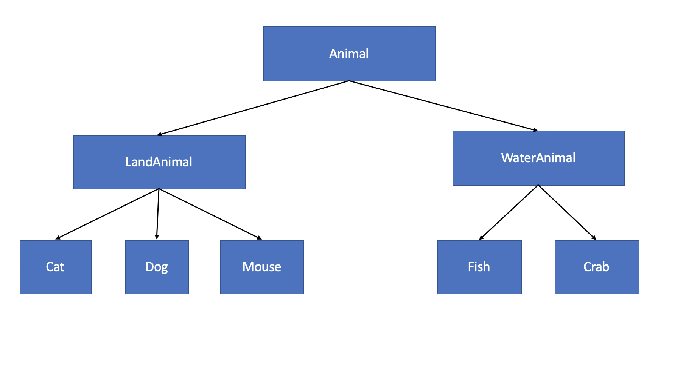
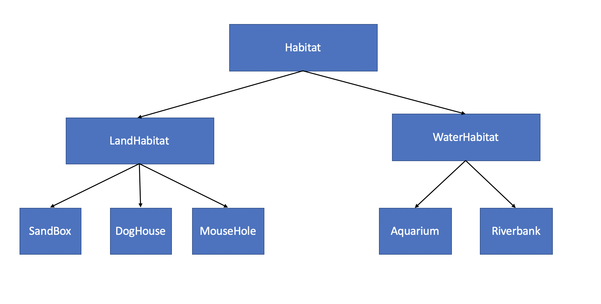

# Generics

## Overview ##

This training aims to introduce you to the basics of Generics in JAVA. Moreover, you will put some of these concepts into practice by performing a laboratory.

Please use your Lion Login to obtain the **[O'Reilly and Pularsight credentials](https://lion.app.box.com/s/venhn6zsx1dr3lr0b76a880yawsg6q9g)** in order to access the videos in the Arrays and Generic Collections chapters, found in the **[Paul Deitel's Java 8 Fundamentals set of videos](https://learning.oreilly.com/videos/java-8-fundamentals/9780133489354)**: 

## Prerequisites and Resources ##

In order to follow the videos correctlly, you should have installed the JDK and a Java IDE beforehand. If you have not done so, you can do it for yourself if you know how to do it, but if not, you can follow the following videos, which will walk you trought the installation of both things.

###  JDK and Java IDE installation (**[Installation and setup environment Videos beginning here](https://learning.oreilly.com/videos/java-8-fundamentals/9780133489354/9780133489354-JFUN_BYB01)**) ###

Recommended IDE to use is IntelliJ IDEA, but if you want to use Eclipse or Netbeans you can do it too. Just follow instructions on the installation video choosing between their respective videos

   * Overview
   * Software Used
   * Installing the JDK (Required) : In this video you can choose between installing just the JDK or the Netbeans bundle, depending on the IDE that you are going to use
   * Installing Eclipse (Optional)
   * Installing IntelliJ IDEA (Optional)

### Feedback Sessions (20min)###

### Resources ###

   * **[Download source code repository](http://www.informit.com/title/9780133489347)**
   * **[Video showing where to find Code Examples](http://www.informit.com/title/9780133489347)**
   
### IDEs Basic functionality ###

   * **[Watch Netbeans Videos beginning here](https://learning.oreilly.com/videos/java-8-fundamentals/9780133489354/9780133489354-JFUN_NetBeans_01)**
   * **[Watch Eclipse Videos beginning here](https://learning.oreilly.com/videos/java-8-fundamentals/9780133489354/9780133489354-JFUN_eclipse_01)**
   * **[Watch IntelliJ IDEA Videos beginning here](https://learning.oreilly.com/videos/java-8-fundamentals/9780133489354/9780133489354-JFUN_IntelliJ_01)**

## Contents ##

### 1. Arrays (**[Watch Lesson 7 Videos beginning here](https://learning.oreilly.com/videos/java-8-fundamentals/9780133489354/9780133489354-JFUN_lesson07_17)** 12m 51s)
   * Generic ArrayList<T> collection demonstration
   
### 2. Generic Collections (**[Watch Lesson 16 Videos beginning here](https://learning.oreilly.com/videos/java-8-fundamentals/9780133489354/9780133489354-JFUN_lesson16_intro)** 1h 32m 44s)
   * Introduction
   * Manipulating lists with List, ArrayList, Collection and Iterator
   * Manipulating lists with List, LinkedList and ListIterator
   * Viewing arrays as Lists and converting Lists to arrays
   * Collections method sort
   * Collections method sort with a Comparator object
   * Collections method sort with a custom Comparator object
   * Card shuffling and dealing with Collections method shuffle
   * Collections methods reverse, fill, copy, max and min
   * Collections method binarySearch
   * Collections methods addAll, frequency and disjoint
   * HashSet used to remove duplicate values from an array of strings
   * Using SortedSets and TreeSets
   * Using a Map to count the number of occurrences of each word in a String

### 3. Generic Classes and Methods (**[Watch Lesson 18 Videos beginning here](https://learning.oreilly.com/videos/java-8-fundamentals/9780133489354/9780133489354-JFUN_lesson18_intro)** 1h 1m 20s)

   * Introduction
   * Overloaded method that perform the exact same task for different types
   * Generic Methods: Implementation and Compile-Time Translation
   * Additional Compile-Time Translation Issues: Methods That Use a Type Parameter as the Return Type
   * Generic Classes: Implementing a Generic Stack Class
   * Creating Generic Methods to Test Class Stack
   * Wildcards in Methods That Accept Type Parameters: Totaling the the numbers in an ArrayList
   * Wildcards in Methods That Accept Type Parameters: Implementing Method sum with a Wildcard Type Argument in Its Parameter

### 4. Wildcards (**[Watch Section 5 here](https://app.pluralsight.com/player?course=java-generics&author=richard-warburton&name=java-generics-m5&clip=0&mode=live)** 34m 35s)

   * Introduction
   * The Substitution Principle
   * Upper Bounded Wildcards
   * Lower Bounded Wildcards
   * Unbounded Wildcards
   * Conclusion

### 5. Excercises
   * The following is a set of excercises that can help you put into practice the knowledge aquired in the videos about Generics.
   
   **[Generics Excercises](Generics Questions and Exercises.docx)** (Estimated time to finish: 3 hours)  

### 6. Challenge (3 hours)

You'll complete a full hands-on generics exercise on whcih you'll put in practice all you learned in this session:

The Farm, we're traing to model all aminmals in farm and their habitats. We'll have water and land animals. For instance the farm will manage only cats, dogS,  mouses, crabs and fishes. 
your job is to build the habitats scheme following the pets scheme in the image and the listed restrictions:

* Use Farm project included in this repo.
* Each animal has its own habitat, each habitat has a collection of animals leaving in there.
* Animal collection should be defined onece in the whole program.
* Each habitat should have a way to add animals to it.
* Implement a function on Farm class (only one, no overloading allowed) to retrive a list of animals from a given habitat.
* Implement a function on Farm class (only one, no overloading allowed) to print the name of each animal on a given list.
* Implement a function on Farm class (only one, no overloading allowed) to add the animals of a given habitat to a given list.

### Feedback Sessions (1h)###
