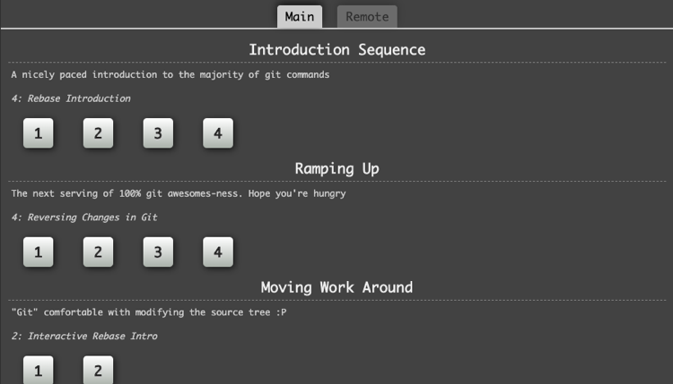

# HANDS ON - Git Practice

## Background
   This following exercise is based on the web client application Learningbranching.js
   
## Practice
Please complete all the exercises created in the following page:
[learngitbranching.js](https://learngitbranching.js.org/)

Please complete the exercises in the order that page suggest as shown below

First complete the exercises in the Main tab and afterwards complete the ones in the Remote tab.

If you have any doubt please reach out to your mentor so that you can clarify all the questions you have. On the other hand you can reach out to [sebpache1@publicisgroupe.net](mailto:sebpache1@publicisgroupe.net])
