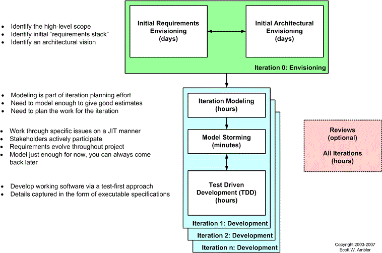

# TDD - Test Driven Development

## What's TDD?
Is a software development process that relies on the repetition of a very short development cycle: requirements are turned into very specific test cases, then the code is improved so that the tests pass. 
This is opposed to software development that allows code to be added that is not proven to meet requirements.

American software engineer Kent Beck, who is credited with having developed or "rediscovered" the technique, stated in 2003 that TDD encourages simple designs and inspires confidence.

I recommend you to watch the following video.
- What is Agile?
	- **https://www.youtube.com/watch?v=Z9QbYZh1YXY&t=6s**
- Agile in Practice: Test Driven Development
    - **https://www.youtube.com/watch?v=uGaNkTahrIw**

## Test Driven Development Cycle
- 1. Add a test
In test-driven development, each new feature begins with writing a test. Write a test that defines a function or improvements of a function, which should be very succinct. To write a test, the developer must clearly understand the feature's specification and requirements. The developer can accomplish this through use cases and user stories to cover the requirements and exception conditions, and can write the test in whatever testing framework is appropriate to the software environment. It could be a modified version of an existing test. This is a differentiating feature of test-driven development versus writing unit tests after the code is written: it makes the developer focus on the requirements before writing the code, a subtle but important difference.
- 2. Run all tests and see if the new test fails
This validates that the test harness is working correctly, shows that the new test does not pass without requiring new code because the required behavior already exists, and it rules out the possibility that the new test is flawed and will always pass. The new test should fail for the expected reason. This step increases the developer's confidence in the new test.
- 3. Write the code
The next step is to write some code that causes the test to pass. The new code written at this stage is not perfect and may, for example, pass the test in an inelegant way. That is acceptable because it will be improved and honed in Step 5.
At this point, the only purpose of the written code is to pass the test. The programmer must not write code that is beyond the functionality that the test checks.
- 4. Run tests
If all test cases now pass, the programmer can be confident that the new code meets the test requirements, and does not break or degrade any existing features. If they do not, the new code must be adjusted until they do.
- 5. Refactor code
The growing code base must be cleaned up regularly during test-driven development. New code can be moved from where it was convenient for passing a test to where it more logically belongs. Duplication must be removed. Object, class, module, variable and method names should clearly represent their current purpose and use, as extra functionality is added. As features are added, method bodies can get longer and other objects larger. They benefit from being split and their parts carefully named to improve readability and maintainability, which will be increasingly valuable later in the software lifecycle. Inheritance hierarchies may be rearranged to be more logical and helpful, and perhaps to benefit from recognized design patterns. There are specific and general guidelines for refactoring and for creating clean code.[6][7] By continually re-running the test cases throughout each refactoring phase, the developer can be confident that process is not altering any existing functionality.
The concept of removing duplication is an important aspect of any software design. In this case, however, it also applies to the removal of any duplication between the test code and the production code—for example magic numbers or strings repeated in both to make the test pass in Step 3.
**Repeat**
Starting with another new test, the cycle is then repeated to push forward the functionality. The size of the steps should always be small, with as few as 1 to 10 edits between each test run. If new code does not rapidly satisfy a new test, or other tests fail unexpectedly, the programmer should undo or revert in preference to excessive debugging. Continuous integration helps by providing revertible checkpoints. When using external libraries it is important not to make increments that are so small as to be effectively merely testing the library itself,[4] unless there is some reason to believe that the library is buggy or is not sufficiently feature-complete to serve all the needs of the software under development.

**TDD completely turns traditional development around. When you first go to implement a new feature, the first question that you ask is whether the existing design is the best design possible that enables you to implement that functionality. If so, you proceed via a TFD approach. If not, you refactor it locally to change the portion of the design affected by the new feature, enabling you to add that feature as easy as possible. As a result you will always be improving the quality of your design, thereby making it easier to work with in the future.**

## Levels of TDD:
- Acceptance TDD (ATDD)
With ATDD you write a single acceptance test, or behavioral specification depending on your preferred terminology, and then just enough production functionality/code to fulfill that test. The goal of ATDD is to specify detailed, executable requirements for your solution on a just in time (JIT) basis. ATDD is also called Behavior Driven Development (BDD).
- Developer TDD
With developer TDD you write a single developer test, sometimes inaccurately referred to as a unit test, and then just enough production code to fulfill that test. The goal of developer TDD is to specify a detailed, executable design for your solution on a JIT basis. Developer TDD is often simply called TDD.

## Scaling TDD via Agile Model-Driven Development (AMDD)
TDD is very good at detailed specification and validation, but not so good at thinking through bigger issues such as the overall design, how people will use the system, or the UI design (for example). Modeling, or more to the point agile model-driven development (AMDD) (the lifecycle for which is captured in Figure 4) is better suited for this. AMDD addresses the agile scaling issues that TDD does not.

**Comparing TDD and AMDD:**
- TDD shortens the programming feedback loop whereas AMDD shortens the modeling feedback loop.
- TDD provides detailed specification (tests) whereas AMDD is better for thinking through bigger issues.
- TDD promotes the development of high-quality code whereas AMDD promotes high-quality communication with your stakeholders and other developers.
- TDD provides concrete evidence that your software works whereas AMDD supports your team, including stakeholders, in working toward a common understanding.
- TDD “speaks” to programmers whereas AMDD speaks to business analysts, stakeholders, and data professionals.
- TDD is provides very finely grained concrete feedback on the order of minutes whereas AMDD enables verbal feedback on the order minutes (concrete feedback requires developers to follow the practice Prove It With Code and thus becomes dependent on non-AM techniques).
- TDD helps to ensure that your design is clean by focusing on creation of operations that are callable and testable whereas AMDD provides an opportunity to think through larger design/architectural issues before you code.
- TDD is non-visually oriented whereas AMDD is visually oriented.
- Both techniques are new to traditional developers and therefore may be threatening to them.
- Both techniques support evolutionary development.

## Myths and Misconceptions
There are several common myths and misconceptions which people have regarding TDD which I would like to clear up if possible.

Myth | Less 
--- | --- 
- You create a 100% regression test suite	| - Although this sounds like a good goal, and it is, it unfortunately isn't realistic for several reasons:  1)I may have some reusable components/frameworks/... which I've downloaded or purchased which do not come with a test suite, nor perhaps even with source code. Although I can, and often do, create black-box tests which validate the interface of the component these tests won't completely validate the component. 2) The user interface is really hard to test. Although user interface testing tools do in fact exist, not everyone owns them and sometimes they are difficult to use. A common strategy is to not automate user interface testing but instead to hope that user testing efforts cover this important aspect of your system. Not an ideal approach, but still a common one. 3) Some developers on the team may not have adequate testing skills. 4) Database regression testing is a fairly new concept and not yet well supported by tools. 5) I may be working on a legacy system and may not yet have gotten around to writing the tests for some of the legacy functionality.
- The unit tests form 100% of your design specification	 | - People new to agile software development, or people claiming to be agile but who really aren't, or perhaps people who have never been involved with an actual agile project, will sometimes say this. The reality is that the unit test form a fair bit of the design specification, similarly acceptance tests form a fair bit of your requirements specification, but there's more to it than this. As Figure 4 indicates, agilists do in fact model (and document for that matter), it's just that we're very smart about how we do it. Because you think about the production code before you write it, you effectively perform detailed design as I highly suggest reading my Single Source Information: An Agile Practice for Effective Documentation article.
- You only need to unit test | - For all but the simplest systems this is completely false. The agile community is very clear about the need for a host of other testing techniques.
- TDD is sufficient for testing	 | - TDD, at the unit/developer test as well as at the customer test level, is only part of your overall testing efforts. At best it comprises your confirmatory testing efforts, but as Figure 5 shows you must also be concerned about independent testing efforts which go beyond this. See Agile Testing and Quality Strategies: Reality over Rhetoric for details about agile testing strategies.
- TDD doesn't scale | - This is partly true, although easy to overcome. TDD scalability issues include: 1) Your test suite takes too long to run. This is a common problem with a equally common solutions. First, separate your test suite into two or more components. One test suite contains the tests for the new functionality that you're currently working on, the other test suite contains all tests. You run the first test suite regularly, migrating older tests for mature portions of your production code to the overall test suite as appropriate. The overall test suite is run in the background, often on a separate machine(s), and/or at night. At scale, I've seen several levels of test suite -- development sandbox tests which run in 5 minutes or less, project integration tests which run in a few hours or less, a test suite that runs in many hours or even several days that is run less often. On one project I have seen a test suite that runs for several months (the focus is on load/stress testing and availability). Second, throw some hardware at the problem. 2) Not all developers know how to test. That's often true, so get them some appropriate training and get them pairing with people with unit testing skills. Anybody who complains about this issue more often than not seems to be looking for an excuse not to adopt TDD. 3) Everyone might not be taking a TDD approach. Taking a TDD approach to development is something that everyone on the team needs to agree to do. If some people aren't doing so, then in order of preference: they either need to start, they need to be motivated to leave the team, or your team should give up on TDD.

## Summary
Test-driven development (TDD) is a development technique where you must first write a test that fails before you write new functional code. TDD is being quickly adopted by agile software developers for development of application source code and is even being adopted by Agile DBAs for database development. TDD should be seen as complementary to Agile Model Driven Development (AMDD) approaches and the two can and should be used together. TDD does not replace traditional testing, instead it defines a proven way to ensure effective unit testing. A side effect of TDD is that the resulting tests are working examples for invoking the code, thereby providing a working specification for the code. My experience is that TDD works incredibly well in practice and it is something that all software developers should consider adopting.

## Tools
The following is a representative list of TDD tools available to you.

- cpputest: https://cpputest.github.io/
- csUnit (.Net): http://www.csunit.org/
- CUnit: http://cunit.sourceforge.net/
- DUnit (Delphi): http://dunit.sourceforge.net/
- DBUnit: http://www.dbunit.org/
- DocTest (Python): https://wiki.python.org/moin/DocTest
- Googletest: https://github.com/google/googletest
- HTMLUnit: http://htmlunit.sourceforge.net/
- HTTPUnit: http://httpunit.sourceforge.net/
- JMock: http://jmock.org/
- JUnit: https://junit.org/junit5/
- Moq: https://code.google.com/archive/p/moq/
- NUnit: https://nunit.org/
- PHPUnit: https://phpunit.de/
- PyUnit (Python): http://pyunit.sourceforge.net/
- TestNG (Java): https://testng.org/doc/ 
- TestOoB (Python): https://wiki.python.org/moin/TestOob
- Test::Unit (Ruby): https://ruby-doc.org/stdlib-2.7.1/libdoc/test/unit/rdoc/Test/Unit.html
- xUnit.net: https://github.com/xunit/xunit	

## Additional recommended videos
- TDD: Test-Driven Development in Java using JUnit
	- **https://www.youtube.com/watch?v=HRxjvaKu-X4**
- Test Driven Development - Java Example 	
	- **https://www.youtube.com/watch?v=Xc3d6j8Rm_I**

## References
- https://en.wikipedia.org/wiki/Test-driven_development
- http://agiledata.org/essays/tdd.html
- https://learnitmyway.com/tdd-example/
- https://technologyconversations.com/2013/12/24/test-driven-development-tdd-best-practices-using-java-examples-2/